# AIT 614 Rutting Prediction Project

## About

In this project, we strive to utilize data obtained from the Federal Highway Administration’s InfoPavement data portal, as well as interpretable machine learning models and techniques, to explain how weather and traffic features affect rutting depth. By doing so, the team anticipates that the project will improve the process of how engineers and planners better predict pavement issues before they occur.

---

## What Is Inside the ZIP File?

The project working system is delivered in a folder called **`ait614_rutting2`** within a ZIP file named **`AIT614-Sec001_Team1_sys.zip`**.

After unzipping, you will see the following structure:
  
ait614_rutting2/  
│── README.md  
│── .gitignore  
│── artifacts/  
│── data/  
│ ├── raw/  
│ └── processed/  
│── code and notebooks/  
  
### Folder and File Descriptions  

- **README.md** - Project description and setup instructions.  
- **.gitignore** - Documents ignored by GitHub during development.  
- **artifacts/** - Contains miscellaneous project items, such as screenshots.  
- **data/raw/** - Raw CSV datasets obtained from the Federal Highway Administration.  
- **data/processed/** - Processed dataset ready for EDA and modeling.  
- **code and notebooks/** - Python scripts and Jupyter notebooks used for processing, EDA, modeling, and evaluation.  

---

## Data  

The data was obtained from the LTPP InfoPavement Data Portal:  

https://infopave.fhwa.dot.gov/Data/DataSelection  

### Raw Data Structure  

data/raw/  
│── climate/  
│ ├── humidity.csv  
│ ├── merra_grid_sections.csv  
│ ├── precipitation.csv  
│ ├── solar.csv  
│ ├── temp.csv  
│ └── wind.csv  
│  
│── rutting/  
│ └── rutting.csv  
│  
│── traffic/  
│ └── traffic_annual.csv  

These are the raw CSV datasets.  The climate features datasets are located in the climate folder.  The traffic features datasets are located in the traffic folder.  The rutting depth target dataset is located in the rutting folder.

### Processed Data

data/processed/  
│── rutting_climate_traffic.csv  

This is the dataset that resulted from data processing and is used for EDA and modeling.

---

## Code and Notebooks

The `code and notebooks` folder contains:

- **processing_notebook.ipynb** - Development notebook for the data processing script (can be ignored).
- **processing_script.py** - Script used to generate processed dataset.
- **EDA_notebook.ipynb** - Exploratory data analysis.
- **baseline_notebook.ipynb** - Baseline model and evaluation.
- **standardized_linear_regression.ipynb** - Standardized linear regression model, tuning, and evaluation.
- **decision_tree_notebook.ipynb** - Decision tree model, tuning, and evaluation.
- **gradient_boosted_decision_trees_notebook.ipynb** - Gradient-boosted decision tree model, tuning, and evaluation.
- **random_forest_notebook.ipynb** - Random forest model, tuning, and evaluation.

---

## Project Working System Setup, Re-compiling, and Re-running Instructions

### 1. Upload Data to DBFS Volumes

After downloading and unzipping the ZIP file, upload the **`ait614_rutting2`** folder to Databricks Free Edition under:

/Workspace/Shared  

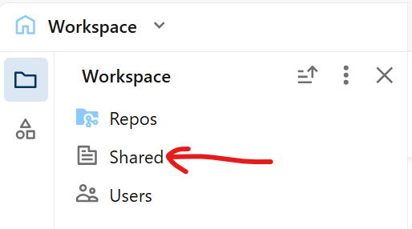
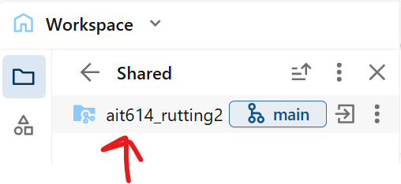

Also, upload the same ait614_rutting2 folder to **Google Drive** (MyDrive):

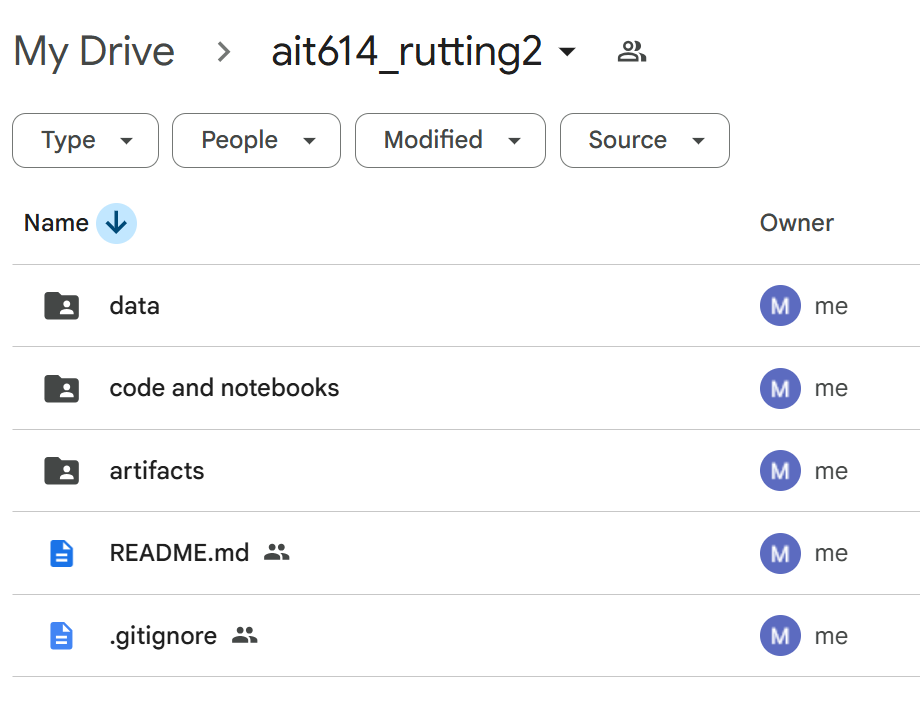

---

### 2. Upload Data Into Databricks DBFS Volumes

In Databricks:

1. Click **New → Add or upload data**

   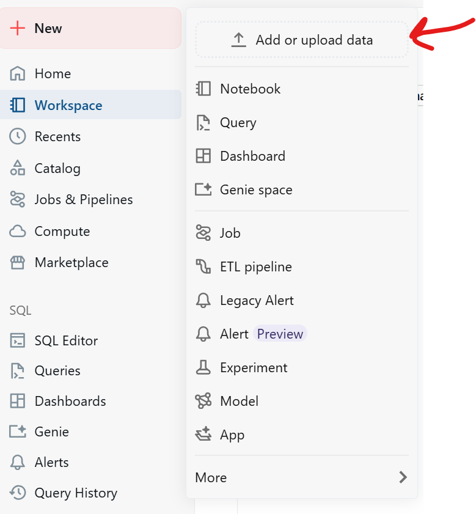

2. Select **Upload files to a volume**

   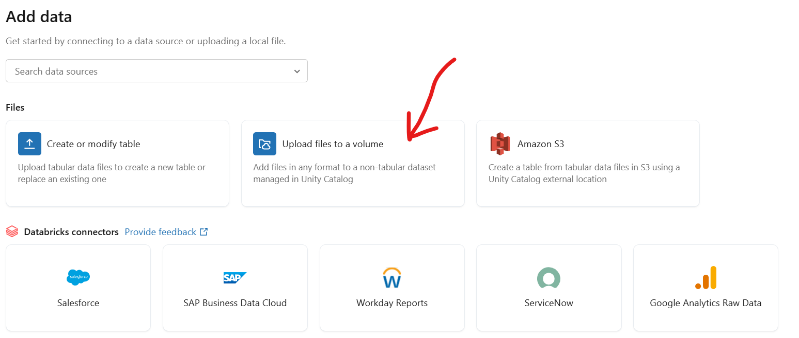

3. Choose **workspace**

   

4. Create a new schema by clicking the + button:

   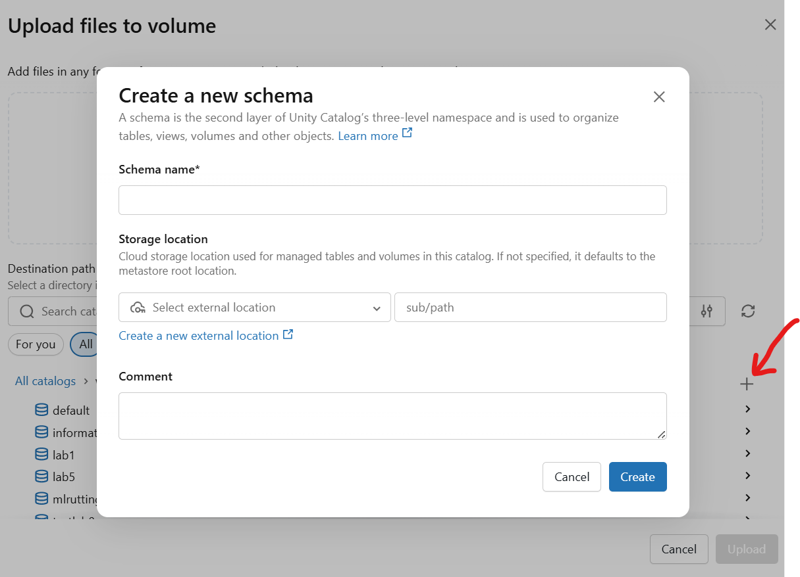

5. Name the schema **mlrutting-3**

   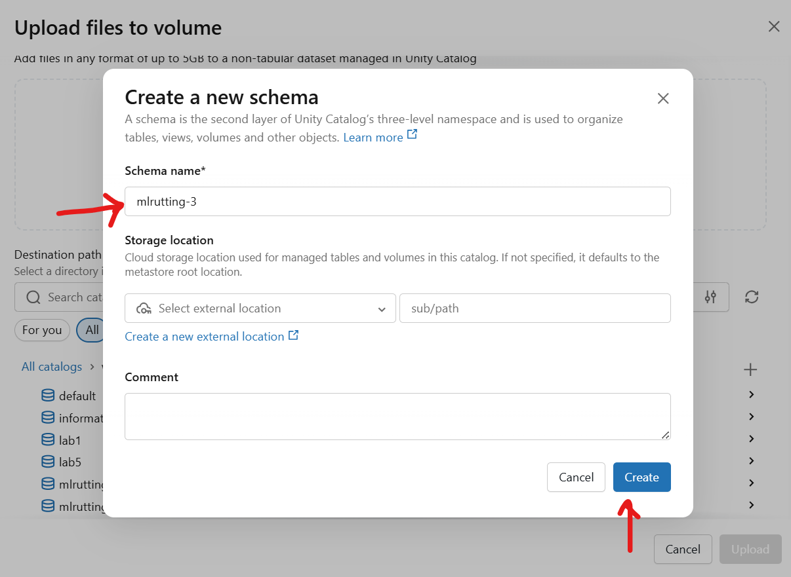

6. Click **Create volume**, also named **mlrutting-3**  

   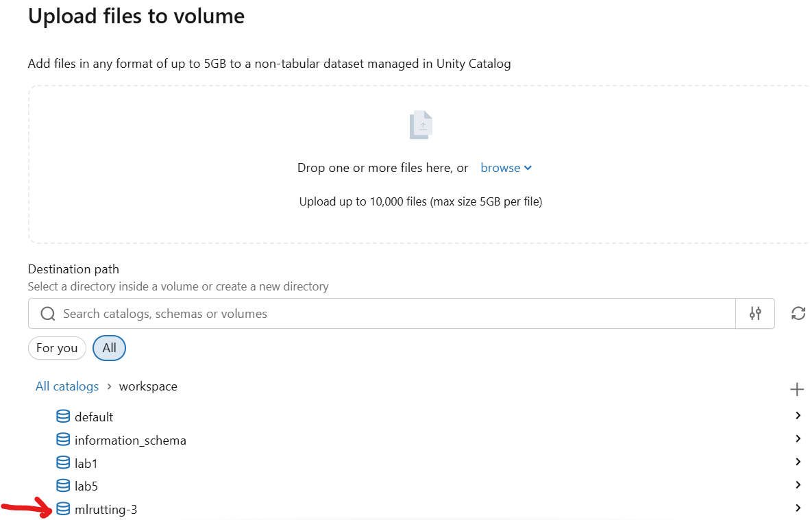  
   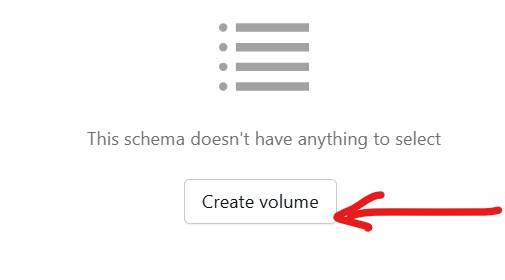  
   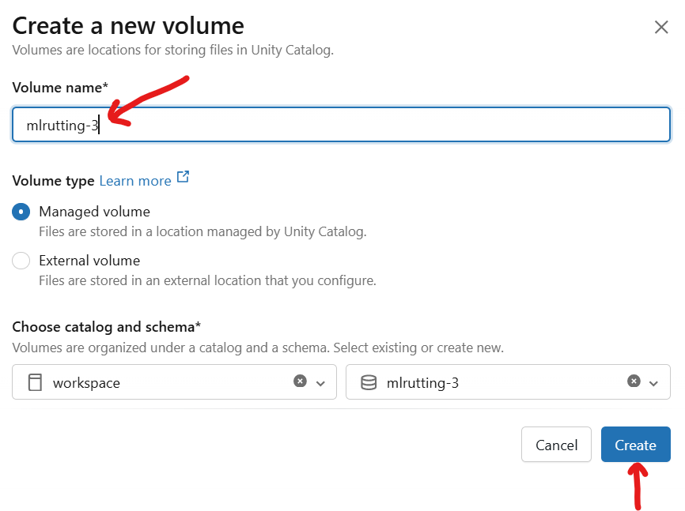  

---

## Data Processing

To generate the processed dataset:

1. Open **`processing_script.py`** from the `code and notebooks` directory.
2. Run the script to create the processed CSV.  This script will upload the processed data to DBFS Volumes.

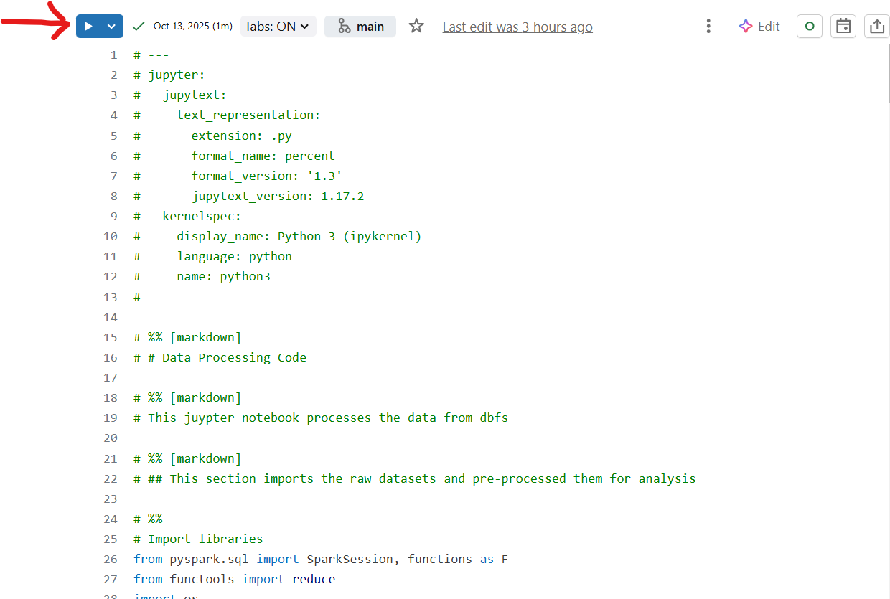

---

## Exploratory Data Analysis (EDA)

To recreate the EDA visualizations and summary statistics found in the exploratory data analysis section of the project paper:

Run **`EDA_notebook.ipynb`** from the `code and notebooks` folder.

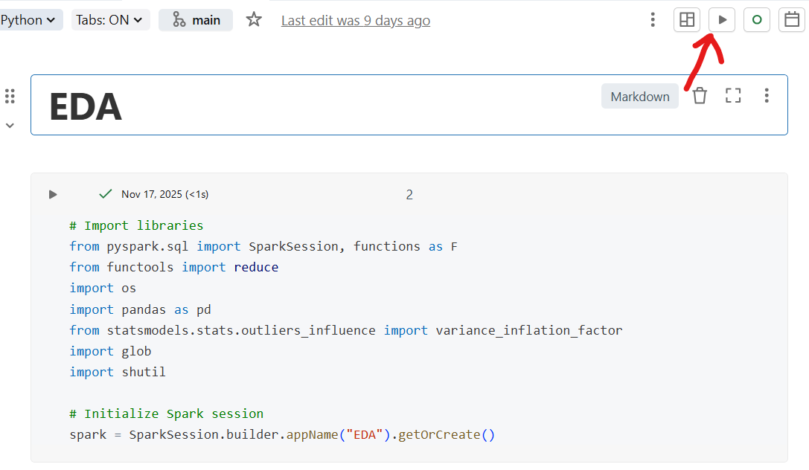

---

## Machine Learning, Modeling, Evaluation, and Feature Importance

In Google Drive, open and run the following notebooks:

- baseline_notebook.ipynb  
- standardized_linear_regression.ipynb  
- decision_tree_notebook.ipynb  
- gradient_boosted_decision_trees_notebook.ipynb  
- random_forest_notebook.ipynb  

Run all cells to reproduce the modeling outputs.  These are the outputs from the modeling outputs section of the project paper.

---

## Conclusion

This concludes the AIT 614 Rutting Prediction Project working system.  
You now have everything needed to process data, perform EDA, run ML models, and interpret results.

---

