# AIT 614 Rutting Prediction Project

## About

In this project, we strive to utilize data obtained from the Federal Highway Administration's InfoPavement data portal, as well as interpretable machine learning models and techniques, to explain how weather and traffic features affect rutting depth. By doing so, the team anticipates that the project will improve the process of how engineers and planners better predict pavement issues before they occur.  

Github link: https://github.com/MattVu123/ait614_rutting2.git

---

## What Is Inside the ZIP File?

The project working system is delivered in a folder called **`ait614_rutting2`** within a ZIP file named **`AIT614-Sec001_Team1_sys.zip`**.

After unzipping, you will see the following structure:
  
ait614_rutting2/  
│── README.md  
│── .gitignore  
│── artifacts/  
│── data/  
│ ├── raw/  
│ └── processed/  
│── code and notebooks/  
  
### Folder and File Descriptions  

- **README.md** - Project description and setup instructions.  
- **.gitignore** - Documents ignored by GitHub during development.  
- **artifacts/** - Contains miscellaneous project items, such as screenshots.  
- **data/raw/** - Raw CSV datasets obtained from the Federal Highway Administration.  
- **data/processed/** - Processed dataset ready for EDA and modeling.  
- **code and notebooks/** - Python scripts and Jupyter notebooks used for processing, EDA, modeling, and evaluation.  

---

## Data  

The data was obtained from the LTPP InfoPavement Data Portal:  

https://infopave.fhwa.dot.gov/Data/DataSelection  

### Raw Data Structure  

data/raw/  
│── climate/  
│ ├── humidity.csv  
│ ├── merra_grid_sections.csv  
│ ├── precipitation.csv  
│ ├── solar.csv  
│ ├── temp.csv  
│ └── wind.csv  
│  
│── rutting/  
│ └── rutting.csv  
│  
│── traffic/  
│ └── traffic_annual.csv  

These are the raw CSV datasets.  The climate features datasets are located in the climate folder.  The traffic features datasets are located in the traffic folder.  The rutting depth target dataset is located in the rutting folder.

### Processed Data

data/processed/  
│── rutting_climate_traffic.csv  

This is the dataset that resulted from data processing and is used for EDA and modeling.

---

## Code and Notebooks

The `code and notebooks` folder contains:

- **processing_notebook.ipynb** - Development notebook for the data processing script (can be ignored).
- **processing_script.py** - Script used to generate processed dataset.
- **EDA_notebook.ipynb** - Exploratory data analysis.
- **baseline_notebook.ipynb** - Baseline model and evaluation.
- **standardized_linear_regression.ipynb** - Standardized linear regression model, tuning, and evaluation.
- **decision_tree_notebook.ipynb** - Decision tree model, tuning, and evaluation.
- **gradient_boosted_decision_trees_notebook.ipynb** - Gradient-boosted decision tree model, tuning, and evaluation.
- **random_forest_notebook.ipynb** - Random forest model, tuning, and evaluation.

---

## Project Working System Setup, Re-compiling, and Re-running Instructions

### 1. Upload Project to Databricks Free Edition and Google Drive.

1. After downloading and unzipping the **`AIT614-Sec001_Team1_sys.zip`** ZIP file on your local machine, there are multiple ways to upload the **`ait614_rutting2`** folder from your local machine to Databricks Free Edition under /Workspace/Shared.  The recommended way to do this is to go to /Workspace/Shared within Databricks Free Edition. 

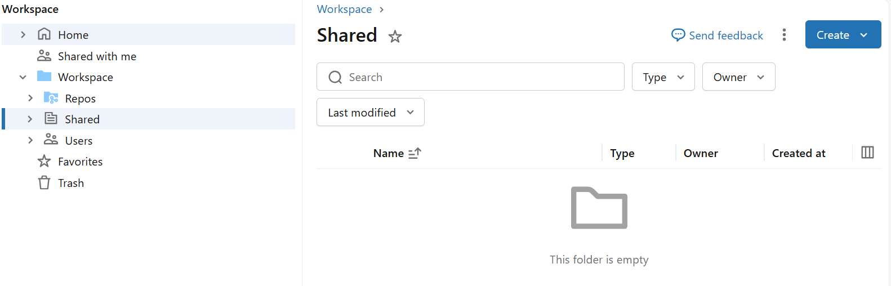  

2. Within Databricks Free Edition, Click **Create** and **Git folder**

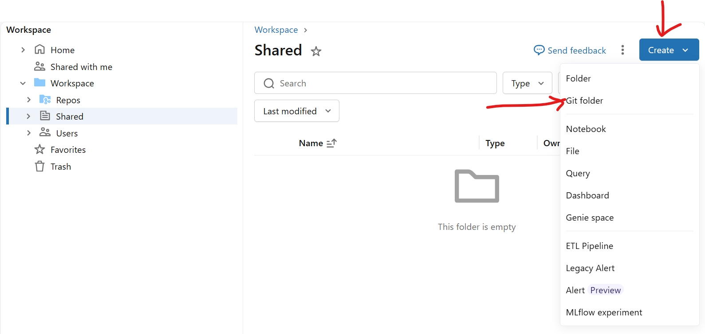 

3. In **Create Git Folder**, copy-and-paste the link https://github.com/MattVu123/ait614_rutting2.git into the **Git repository URL**.  Click **Create Git folder**.

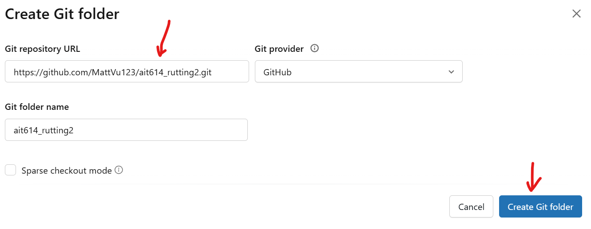

4.  Now, you have to **Import** the data from your **`ait614_rutting2`** folder on your local machine into Databricks.  Github does not allow large datasets to be uploaded to it.  To do this, Click **Create** and **Folder** within **`ait614_rutting2`** in Databricks.

5.  Name the folder **data** and click **Create** 

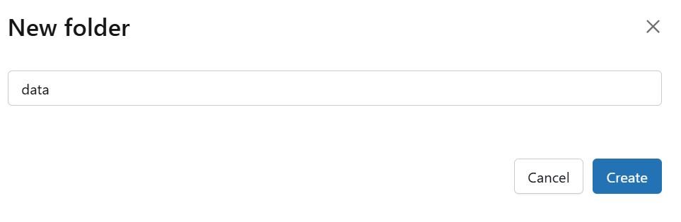

6.  Within the **data** folder on Databricks, create subfolders **processed** and **raw**.  Within **raw**, create subfolders **climate**, **rutting**, and **traffic**.  Within **processed**, there is no need for another subfolder.  Then, **Import** all the CSV datasets from your **`ait614_rutting2`** folder on your local machine into the **data** folder in Databricks following this structure:

data/raw/  
│── climate/  
│ ├── humidity.csv  
│ ├── merra_grid_sections.csv  
│ ├── precipitation.csv  
│ ├── solar.csv  
│ ├── temp.csv  
│ └── wind.csv  
│  
│── rutting/  
│ └── rutting.csv  
│  
│── traffic/  
│ └── traffic_annual.csv  

data/processed/  
│── rutting_climate_traffic.csv  

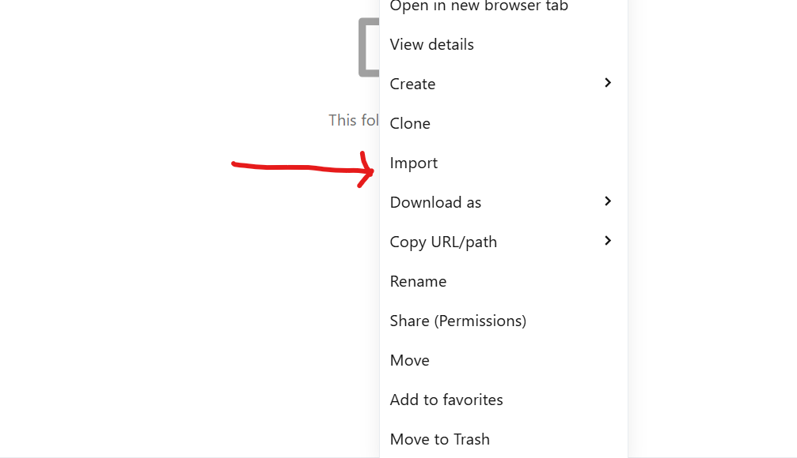  

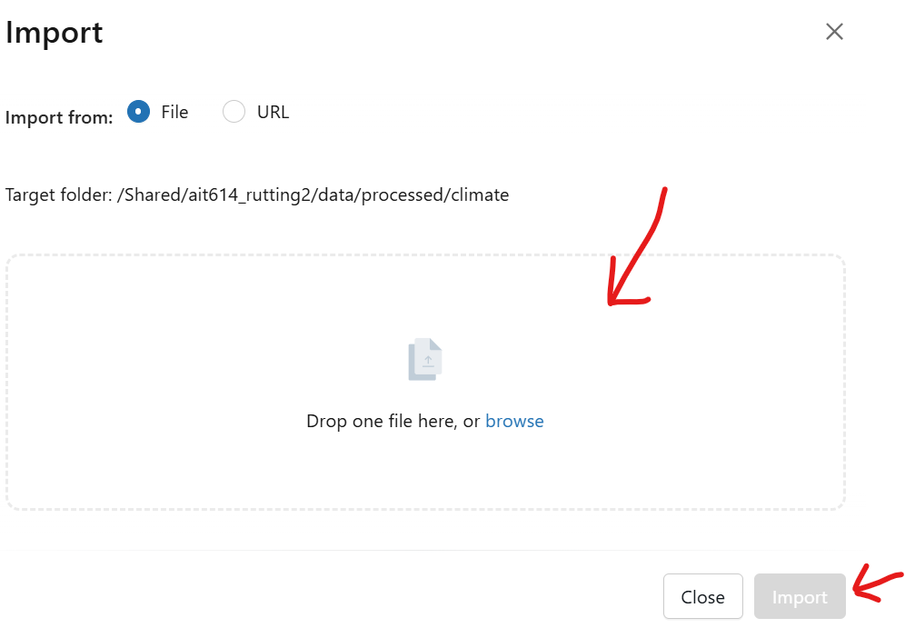  

7.  Now, your **`ait614_rutting2`** folder in Databricks should look identical to the **`ait614_rutting2`** folder on your local machine. 

8.  Next, upload the **`ait614_rutting2`** folder on your local machine to **Google Drive** (MyDrive).  To do this within Google Drive, Click **Folder Upload** and upload the **`ait614_rutting2`** folder from your local machine to MyDrive.  Important: Ensure that you place the **`ait614_rutting2`** folder in the immediate MyDrive directory as seen in the screenshots below to ensure paths are correct (e.g. MyDrive/ait614_rutting2).  

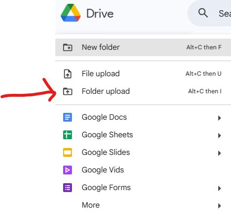

9.  Now, you should have exact copies of the **`ait614_rutting2`** folder from your local machine in Databricks Free Edition and Google Drive.

---

### 2. Upload Data Into Databricks DBFS Volumes

In Databricks:

1. Click **New → Add or upload data**

   

2. Select **Upload files to a volume**

   

3. Choose **workspace**

   

4. Create a new schema by clicking the **+** button

   

5. Name the schema **mlrutting-3** and click **Create**

   

6. Click **mlrutting-3** in **workspace**  

     

7. Click **Create volume**.

     

8. Name the volume **mlrutting-3** and click **Create**

     

9.  Now within /workspace/mlrutting-3/mlrutting-3/ upload all CSV data files from your local machine to volume.

   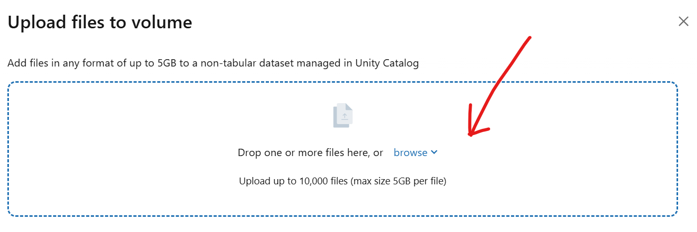  

   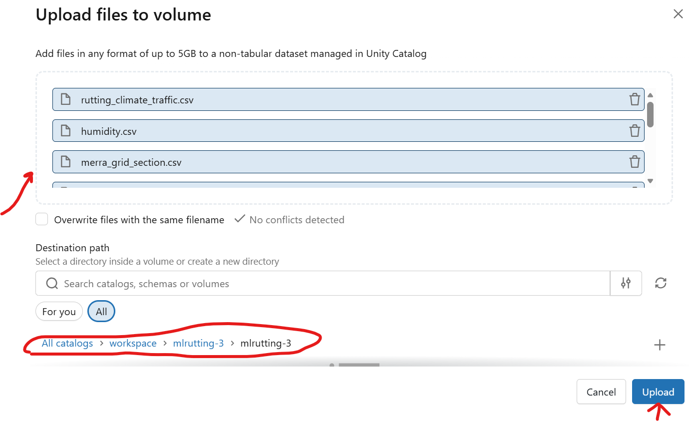  

   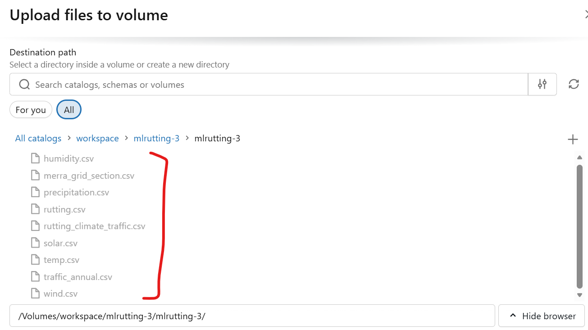 

---

## Data Processing

In Databricks Free Edition, to replicate generating the processed dataset:

1. In Databricks Free Edition, open **`processing_script.py`** from the `code and notebooks` directory.
2. Run the script to create the processed CSV.  This script will upload the processed data to DBFS Volumes.

Special Note: Data processing was done in Databricks Free Edition.

---

## Exploratory Data Analysis (EDA)

In Databricks Free Edition, to recreate the EDA visualizations and summary statistics found in the exploratory data analysis section of the project paper:

Run **`EDA_notebook.ipynb`** from the `code and notebooks` folder.

Special Note: EDA was done in Databricks Free Edition.

---

## Machine Learning, Modeling, Evaluation, and Feature Importance

To recreate our modeling outputs, open and run the following notebooks in Google Drive and Google Colab:

- baseline_notebook.ipynb  
- standardized_linear_regression.ipynb  
- decision_tree_notebook.ipynb  
- gradient_boosted_decision_trees_notebook.ipynb  
- random_forest_notebook.ipynb  

Run all cells to reproduce the modeling outputs, such as tuned hyperparameters (all models), 5-fold CV RMSE values (all models), test RMSE (random forest), model coefficients (standardized linear regression), and feature importance plots (all models).  These are the outputs from the modeling outputs section of the project paper.  If you are prompted to permit this notebook to access your Google Drive files, then click **Connect to Google Drive** and keep clicking **continue** or **grant access** to all files.  Run each notebook individually, they take some time to run.

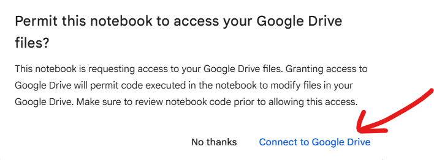

Special Note: Modeling and evaluation was done in Google Drive and Google Colab.

---

## Conclusion

This concludes the AIT 614 Rutting Prediction Project working system.  
You now have everything needed to process data, perform EDA, run ML models, and interpret results.

---

